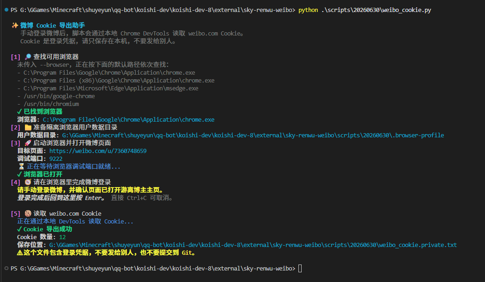
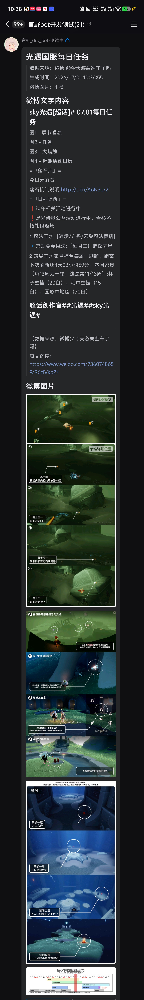

# koishi-plugin-sky-renwu-weibo

[](https://www.npmjs.com/package/koishi-plugin-sky-renwu-weibo)
[](https://www.npmjs.com/package/koishi-plugin-sky-renwu-weibo)

[](https://github.com/VincentZyuApps/koishi-plugin-sky-renwu-weibo)
[](https://gitee.com/vincent-zyu/koishi-plugin-sky-renwu-weibo)

[](https://forum.koishi.xyz/t/topic/xxxxx)
[](https://qm.qq.com/q/ZN7fxZ3qCq)

<h2>💬 交流反馈</h2>
<p>🐛 Bug 反馈 / 💡 建议 / 👨‍💻 插件开发交流，欢迎加群：</p>
<p><del>💬 插件使用问题 / 🐛 Bug反馈 / 👨‍💻 插件开发交流，欢迎加入QQ群：<b>259248174</b>   🎉（这个群G了）</del></p> 
<p>💬 插件使用问题 / 🐛 Bug反馈 / 👨‍💻 插件开发交流，欢迎加入QQ群：<b>1085190201</b> 🎉</p>
<p>💡 在群里直接艾特我，回复的更快哦~ ✨</p>

📅✅ 获取微博博主 `@今天游离翻车了吗` 的光遇国服每日任务，支持文字、图片、Puppeteer 卡片图和 QQ Markdown ✨

> 🙏 特别感谢微博博主 `@今天游离翻车了吗` 多年来稳定更新光遇每日任务内容。这个插件只是做自动化获取和转发，真正持续维护每日攻略内容的是博主本人。

## 📌 指令

```text
今日国服
```

命令名称可以在配置项 `commandName` 中修改。

## 🔐 微博 Cookie

微博接口通常需要登录 Cookie。可以运行仓库内的辅助脚本打开有头浏览器，手动登录微博后导出 `weibo.com` Cookie。

由于安全原因，插件不会内置任何微博登录 Cookie，也不建议把 Cookie 写进源码、README、issue 或聊天记录中。请自行登录微博并获取自己的 Cookie。

由于浏览器安全策略和跨域限制，Koishi Console 页面暂时无法直接读取 `weibo.com` 的登录 Cookie，因此获取 Cookie 的流程目前没有内置到浏览器 WebUI 中。后续如果找到更稳定、安全的实现方式，可能会在新版本中提供更方便的获取流程。

脚本说明见：[scripts/readme.md](./scripts/readme.md)

脚本会优先使用 `--browser` 传入的浏览器路径；如果没有传入，会依次尝试寻找下面这些默认路径：

```text
C:\Program Files\Google\Chrome\Application\chrome.exe
C:\Program Files (x86)\Google\Chrome\Application\chrome.exe
C:\Program Files\Microsoft\Edge\Application\msedge.exe
/usr/bin/google-chrome
/usr/bin/chromium
```

你也可以使用 `--browser` 参数指定浏览器路径。

```bash
# 🪟 on Windows：使用默认路径自动查找
python scripts\20260630\weibo_cookie.py
# 🪟 on Windows：也可以使用 --browser 指定浏览器路径
python scripts\20260630\weibo_cookie.py --browser "C:\Program Files\Google\Chrome\Application\chrome.exe"
# 🐧 on Linux：使用默认路径自动查找
python scripts/20260630/weibo_cookie.py
# 🐧 on Linux：也可以使用 --browser 指定浏览器路径
python scripts/20260630/weibo_cookie.py --browser "/usr/bin/google-chrome"
```

运行后目录大致如下：

```text
scripts/
└── 20260630/
    ├── weibo_cookie.py             # 🌐 打开有头浏览器，登录微博并导出 Cookie
    ├── latest.debug.log            # 🧾 调试日志，包含本地运行信息
    ├── weibo_cookie.private.txt    # 🔐 需要填入配置项 weiboCookie 的值
    └── .browser-profile/           # 🗂️ 隔离浏览器用户数据目录，可能包含登录态
```

把 `weibo_cookie.private.txt` 的内容填入 Koishi 插件配置项 `weiboCookie`。

`weibo_cookie.private.txt`、`latest.debug.log` 和 `.browser-profile` 都包含隐私信息，不要发给别人，也不要提交到 Git。



## 💬 输出方式

插件配置项 `msgFormArr` 是表格形式：每一行选择一种发送形式，并通过 `enabled` 控制是否启用。可以调整行顺序，插件会按表格顺序发送；`strictOrderMode=false` 时会并行发送，发送顺序不保证。

- 📄➕🖼️ `text-with-image`：先文后图，一条消息内先发送微博长文本，再发送全部图片
- 🖼️➕📄 `image-with-text`：先图后文，一条消息内先发送全部图片，再发送微博长文本
- 📄 `text`：纯文字，只发送微博长文本、数据来源和原文链接
- 📦 `forward`：图文合并转发，把文字和图片打包进 OneBot 合并转发
- 🖼️ `puppeteer-image`：Puppeteer 卡片图，把文字和微博图片排版成一张圆角卡片图
- 🤖 `qq-markdown`：QQ 官方 Bot Markdown 正文消息，只有 QQ 官方 Bot 平台能用；操作按钮行为由 `qqMarkdownButtonMode` 控制

默认启用 `forward` 和 `puppeteer-image`。

`puppeteer-image` 模式需要启用 Koishi 的 `puppeteer` 服务；未启用时插件会跳过该发送形式。`append-puppeteer-image` 按钮行为还需要启用 Koishi `assets` 服务，并确保 `assets` / `server` 的 `selfUrl` 已穿透到公网，否则 QQ 官方 Bot 无法访问图片 URL。

### 🖼️ 效果预览




## 🔧 配置项

### 🔑 微博来源配置

| 配置项 | 类型 | 默认值 | 说明 |
|---|---|---|---|
| `commandName` | `string` | `"今日国服"` | 触发命令名称 |
| `uid` | `string` | `"7360748659"` | 微博用户 UID，默认是 `@今天游离翻车了吗` |
| `authorName` | `string` | `"今天游离翻车了吗"` | 来源作者显示名，会展示在数据来源署名里 |
| `weiboCookie` | `string` | `""` | 微博登录 Cookie，必填；可用 `scripts/20260630/weibo_cookie.py` 导出 |
| `matchPattern` | `string` | 默认正则 | 筛选每日任务微博的正则表达式，微博文案格式变化时可调整 |

### 🌐 请求与缓存配置

| 配置项 | 类型 | 默认值 | 说明 |
|---|---|---|---|
| `cacheMinutes` | `number` | `20` | 内存缓存分钟数；`0` 表示不缓存 |
| `requestTimeout` | `number` | `10000` | 微博请求超时时间，单位毫秒 |
| `userAgent` | `string` | Edge/Chrome UA | 请求微博使用的 User-Agent，通常保持默认即可 |

### 💬 消息发送形式配置

| 配置项 | 类型 | 默认值 | 说明 |
|---|---|---|---|
| `enableQuote` | `boolean` | `true` | bot 发送普通消息时是否引用触发指令；`forward` 合并转发模式不会附带引用 |
| `enableWaitingHint` | `boolean` | `true` | 是否显示“获取并生成中.... 请耐心等待”等待提示；所有发送形式完成后会尝试撤回 |
| `msgFormArr` | `{ mode, enabled }[]` | 见默认表格 | 每日任务发送形式表格，可调整顺序，可启用 / 禁用；默认启用 `forward` 和 `puppeteer-image` |
| `strictOrderMode` | `boolean` | `true` | 是否严格按照表格顺序串行发送；关闭后会并行发送，顺序不保证 |

### 🤖 QQ 官方 Bot Markdown 适配

| 配置项 | 类型 | 默认值 | 说明 |
|---|---|---|---|
| `qqMarkdownMode` | `"structured" \| "blockquote"` | `"structured"` | QQ Markdown 文案整理模式；`structured` 会尝试按正则整理标题、任务条目和来源，`blockquote` 会把全文逐行放进引用块 |
| `qqMarkdownButtonMode` | `string[]` | `[]` | QQ Markdown 按钮发送行为，可多选；`standalone` 单独发送固定的 `## 光遇任务操作按钮` 消息并附带按钮，`append-qq-markdown` 在启用 `qq-markdown` 发送形式时把按钮挂到正文 Markdown 后面，`append-puppeteer-image` 在启用 `puppeteer-image` 发送形式时把 Puppeteer 卡片图通过 assets 转成公网 URL 后发送 Markdown 图片并附带按钮 |
| `qqMarkdownKeyboardJson` | `string` | 默认按钮 JSON | QQ Markdown 按钮 JSON 配置；默认一行两个按钮：`再次获取` 执行 `${commandName}`，`玩玩别的` 执行 `help` |

`append-qq-markdown` 必须同时启用 `qq-markdown`。`append-puppeteer-image` 必须同时启用 `puppeteer-image`，并依赖 Koishi `assets` 服务提供公网 `http(s)` 图片地址。如果条件不满足，插件会在会话和 console 中提醒，但不会自动补发；不想在 QQ 平台发送按钮时保持空选即可。

### 🖼️ Puppeteer 卡片图配置

| 配置项 | 类型 | 默认值 | 说明 |
|---|---|---|---|
| `imageType` | `"png" \| "jpeg" \| "webp"` | `"png"` | Puppeteer 卡片图输出格式；PNG 不支持质量参数 |
| `screenshotQuality` | `number` | `88` | Puppeteer 卡片图截图质量，仅 JPEG / WEBP 生效 |
| `imageWidth` | `number` | `980` | Puppeteer 卡片图宽度，单位 px |
| `useCustomFont` | `boolean` | `true` | 是否使用自定义字体路径；关闭后使用系统默认字体，并跳过默认字体下载 |
| `autoDownloadFont` | `boolean` | `true` | 是否自动下载并校验默认字体 |
| `imageFontPath` | `string` | `process.cwd()/data/fonts/LXGWWenKaiMono-Regular.ttf` | Puppeteer 卡片图字体路径；运行时自动映射到 `ctx.baseDir/data/fonts/LXGWWenKaiMono-Regular.ttf` |

Puppeteer 卡片图默认使用 `LXGWWenKaiMono-Regular.ttf`。插件加载时会检查 `ctx.baseDir/data/fonts/LXGWWenKaiMono-Regular.ttf`。字体存在且 hash 校验通过时会跳过下载；缺失或校验失败时会尝试从 Gitee / GitHub 下载。配置项 `useCustomFont=false` 或 `imageFontPath` 为空时会使用系统默认字体。

### 🐛 调试配置

| 配置项 | 类型 | 默认值 | 说明 |
|---|---|---|---|
| `verboseSessionLog` | `boolean` | `false` | 是否在会话中输出详细调试信息；当前关键条件不满足提醒会默认输出，此配置预留给后续更细的调试日志 |
| `verboseConsoleLog` | `boolean` | `false` | 是否在控制台输出详细调试信息；当前关键 fallback 提醒会默认输出。开启后会输出缓存、微博抓取、渲染、发送、assets 上传和字体检查细节 |
